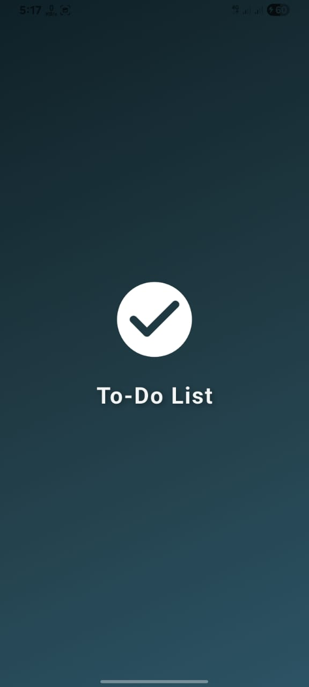
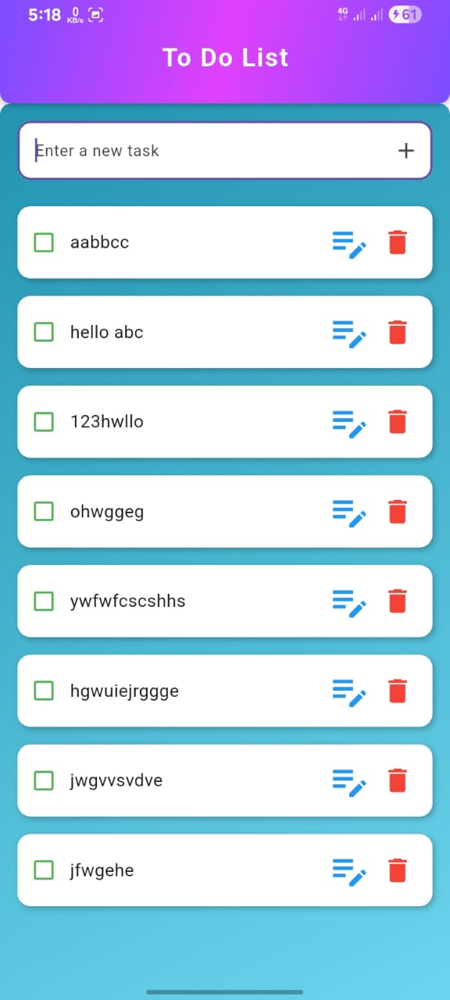
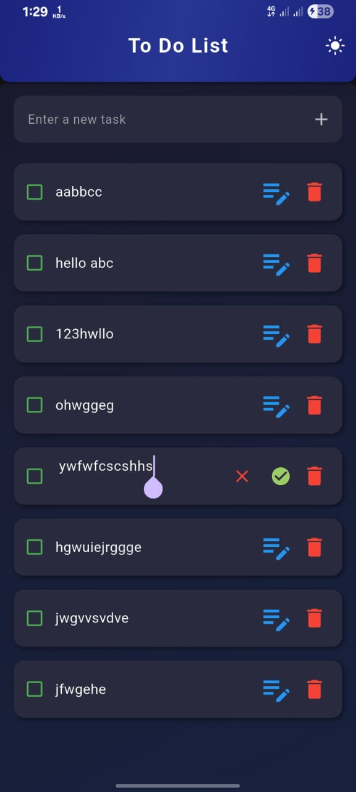
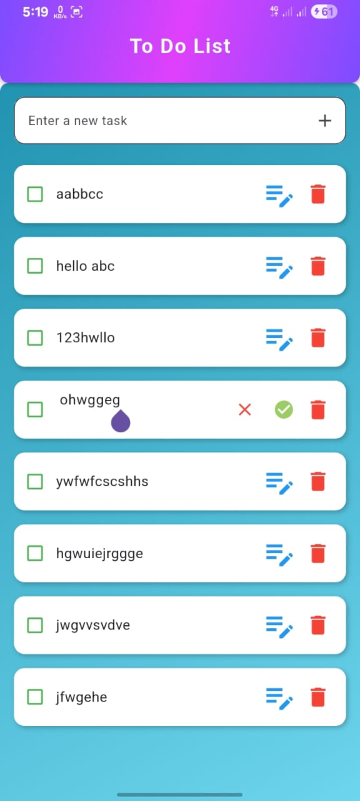

# 📝 Task Remind - Flutter To-Do Application

A modern To-Do List app built with Flutter featuring adaptive theming and local data persistence.

## 📱 Screenshots

<div align="center">
  
  
  
  
</div>

## ✨ Key Features

### 🎨 Dark/Light Mode Toggle
- One-tap theme switching with persistent preference
- Beautiful adaptive gradients for both themes
- Dynamic UI elements that respond to theme changes

### 📋 Complete Task Management
- Create, Read, Update, Delete (CRUD) operations
- Inline task editing
- Mark tasks as complete with visual feedback
- Automatic local storage with `SharedPreferences`

### 🎭 Polished UI/UX
- Animated splash screen
- Gradient backgrounds
- Smooth transitions and animations

## 🛠️ Tech Stack

- **Flutter SDK**: ^3.8.0
- **shared_preferences**: ^2.5.3

## 🚀 Installation

```bash
git clone https://github.com/yourusername/task_remind.git
cd task_remind
flutter pub get
flutter run
```

## 📂 Project Structure

```
lib/
├── main.dart              # Entry point & theme configuration
└── pages/
    ├── splashscreen.dart  # Animated splash
    └── homepage.dart      # Main To-Do screen
```

## 🎓 Learning Outcomes

- Flutter widget composition & state management
- Local storage with JSON serialization
- Theme management & persistence
- Responsive UI design with animations

---

